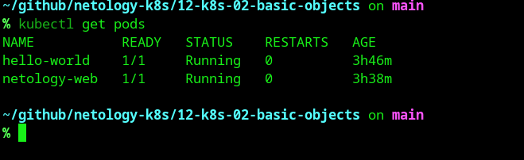
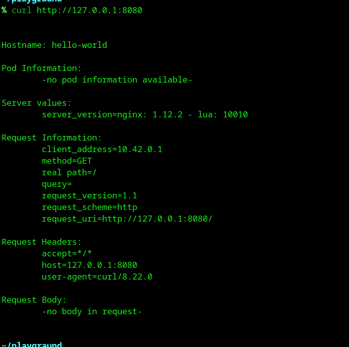
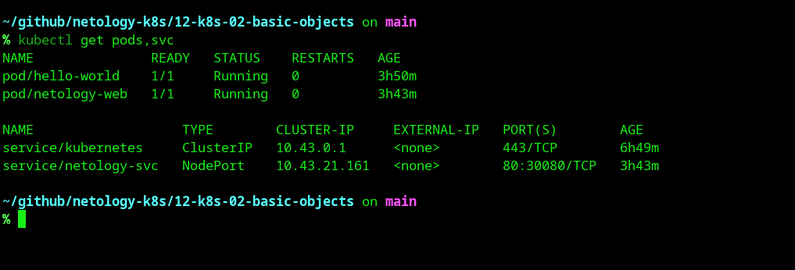
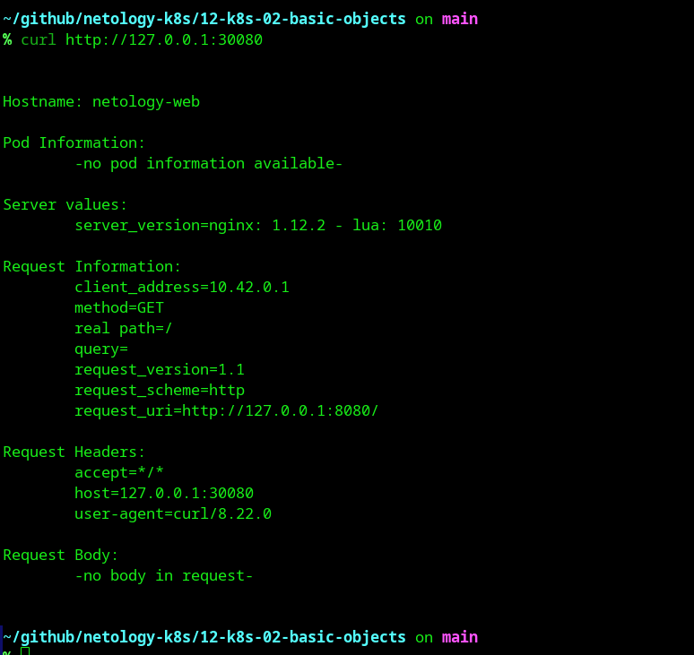

# Домашнее задание к занятию «Базовые объекты K8S»

Рабочая среда: **Arch Linux**, локальный кластер **k3s v1.37.0+k3s1**.

## Ссылки на манифесты
* [Манифест Pod hello-world](./hello-world-pod.yaml)
* [Манифест Pod и Service netology](./netology-web-svc.yaml)

---

## Выполнение Задания 1 (Pod hello-world)

1. Был создан и применен манифест для создания Pod `hello-world`.
2. Проверка статуса Pod с помощью `kubectl get pods`:

   

3. Из-за известной особенности сетевого плагина k3s в Arch Linux (ошибка `lookup localhost: no such host` внутри network namespace контейнера), стандартный `kubectl port-forward` падал с ошибкой.
4. Трафик до пода был успешно проброшен на локальный порт `8080` с помощью утилиты `socat` напрямую на внутренний IP пода (`10.42.0.12`).
5. Результат подключения через `curl http://127.0.0.1:8080`:

   

---

## Выполнение Задания 2 (Pod netology-web и Service)

1. Был создан совмещенный манифест для Pod `netology-web` и Service `netology-svc`.
2. Сервис настроен с типом `NodePort` на порт `30080` для обеспечения стабильного локального доступа на Arch Linux.
3. Проверка статуса объектов с помощью `kubectl get pods,svc`:

   

4. Результат проверки доступности приложения через `curl http://127.0.0.1:30080`:

   
