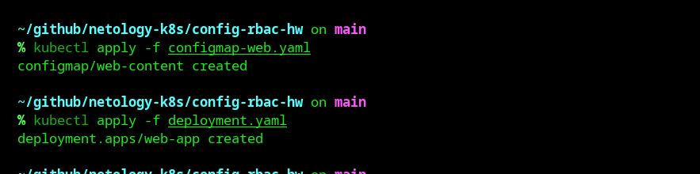
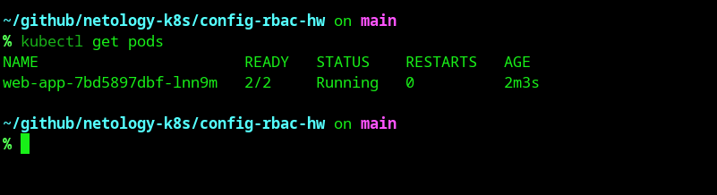
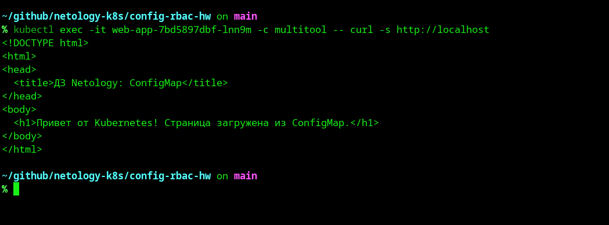
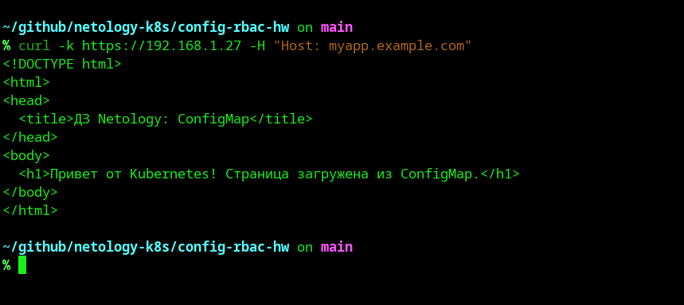
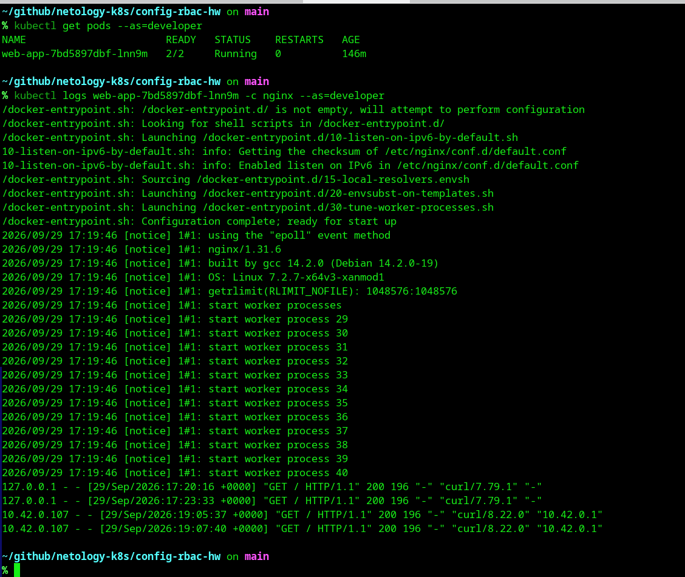

# Домашнее задание: Настройка приложений и управление доступом в Kubernetes
**Выполнил:** Шаров Олег

## Задание 1: Работа с ConfigMaps

Применение манифестов:


Статус подов (2/2 Running):


Проверка доступности страницы из ConfigMap:


---

## Задание 2: Настройка HTTPS с Secrets

**Команда генерации самоподписанного сертификата:**
```bash
openssl req -x509 -nodes -days 365 -newkey rsa:2048 \
  -keyout tls.key -out tls.crt -subj "/CN=myapp.example.com"
```

**Примененные манифесты:** `secret-tls.yaml`, `service.yaml`, `ingress-tls.yaml`

Проверка HTTPS-доступа (Traefik Ingress):


---

## Задание 3: Настройка RBAC

**Команды генерации сертификата для пользователя developer:**
```bash
# Генерация ключа и CSR
openssl genrsa -out developer.key 2048
openssl req -new -key developer.key -out developer.csr -subj "/CN=developer"

# Подпись сертификата CA кластера k3s
sudo openssl x509 -req -in developer.csr \
  -CA /var/lib/rancher/k3s/server/tls/server-ca.crt \
  -CAkey /var/lib/rancher/k3s/server/tls/server-ca.key \
  -CAcreateserial -out developer.crt -days 365
```

**Примененные манифесты:** `role-pod-reader.yaml`, `rolebinding-developer.yaml`

Проверка прав пользователя developer (просмотр подов и логов):

```
