# Домашнее задание к занятию «Helm» - Шаров Олег

## Цель задания
В тестовой среде Kubernetes необходимо установить и обновить приложения с помощью Helm.

## Чеклист готовности
- [x] Установленное k8s-решение (k3s).
- [x] Установленный локальный kubectl.
- [x] Установленный локальный Helm.
- [x] Редактор YAML-файлов с подключенным репозиторием GitHub.

---

## Задание 1. Подготовить Helm-чарт для приложения

Необходимо упаковать приложение (nginx) в чарт для деплоя в разные окружения. Каждый компонент приложения деплоится отдельным deployment'ом. В переменных чарта настроено изменение образа приложения для изменения версии.

### Структура чарта
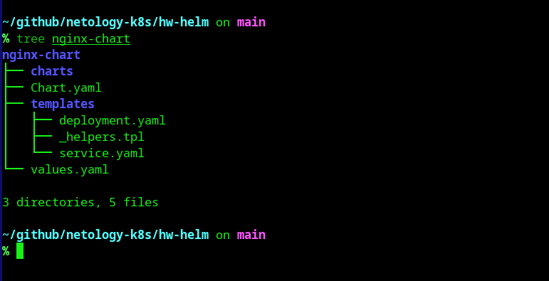

### Настройка переменных (values.yaml)
Версия образа задается через переменную `image.tag`.
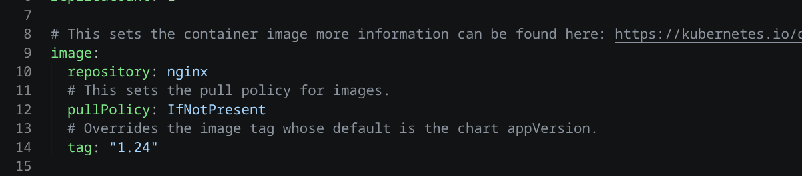

### Шаблон Deployment (deployment.yaml)
Образ подставляется динамически из переменных чарта.
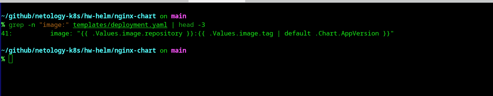

### Валидация чарта
Проверка чарта на ошибки с помощью `helm lint`.
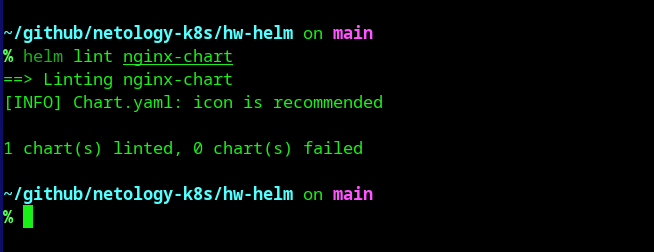

*Ссылки на полные тексты манифестов:*
- [Chart.yaml](nginx-chart/Chart.yaml)
- [values.yaml](nginx-chart/values.yaml)
- [templates/deployment.yaml](nginx-chart/templates/deployment.yaml)
- [templates/service.yaml](nginx-chart/templates/service.yaml)

---

## Задание 2. Запустить две версии в разных неймспейсах

Запущено три копии приложения с разными версиями образа в двух неймспейсах:
- Версия 1.24 в namespace `app1`
- Версия 1.25 в namespace `app1` (под другим именем релиза)
- Версия 1.26 в namespace `app2`

### 1. Создание неймспейсов
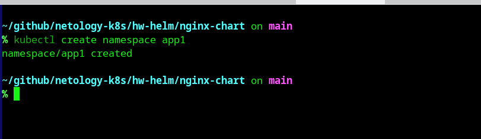
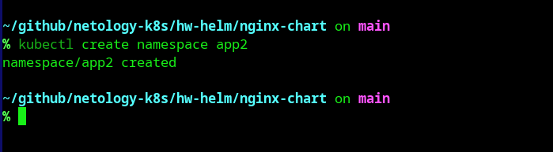

### 2. Установка релизов
Установка первой версии (1.24) в неймспейс `app1`:
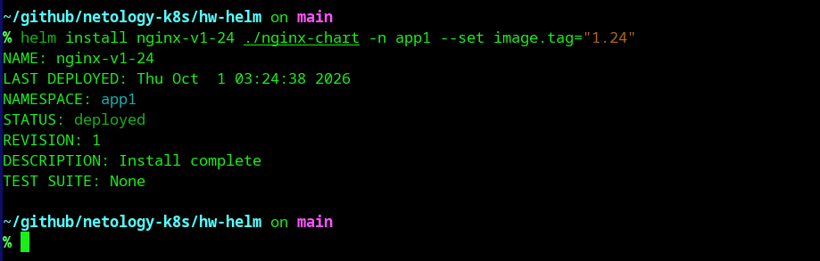

Установка второй версии (1.25) в неймспейс `app1`:
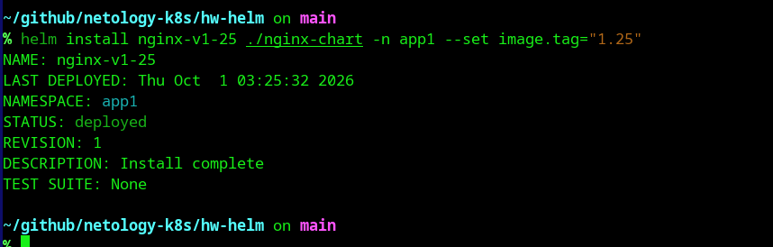

Установка третьей версии (1.26) в неймспейс `app2`:
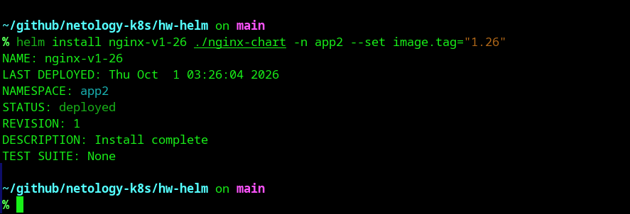

### 3. Демонстрация результата
Список релизов в неймспейсе `app1` (два релиза):
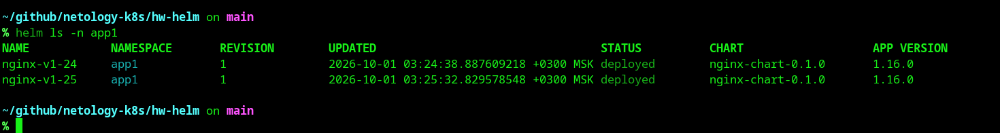

Список релизов в неймспейсе `app2` (один релиз):
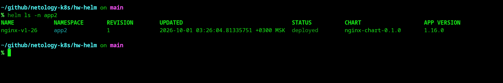

Проверка подов в `app1`:
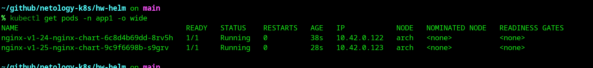

Проверка подов в `app2`:
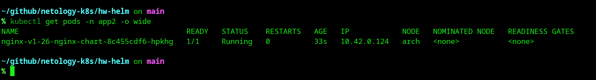

### 4. Подтверждение версий образов
Проверка, что поды используют правильные версии nginx:

Версии в namespace `app1`:
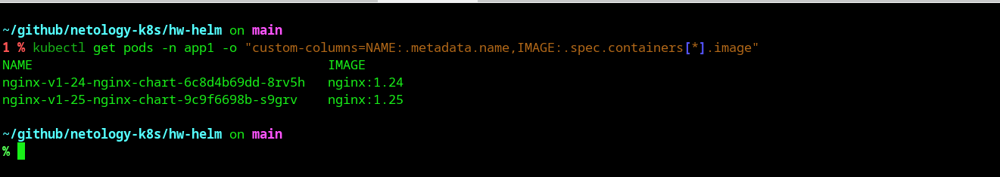

Версия в namespace `app2`:
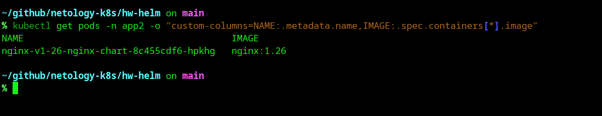

---

## Итог
Задание выполнено:
1. Создан Helm-чарт для nginx с возможностью изменения версии через переменные.
2. Запущены три разных версии приложения в двух неймспейсах.
3. Две версии в одном неймспейсе работают без конфликтов благодаря разным именам релизов Helm.