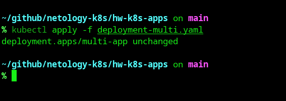
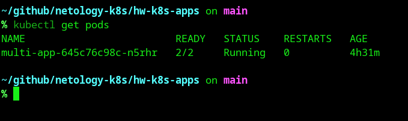
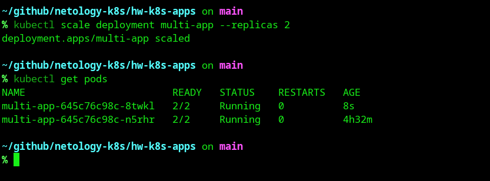
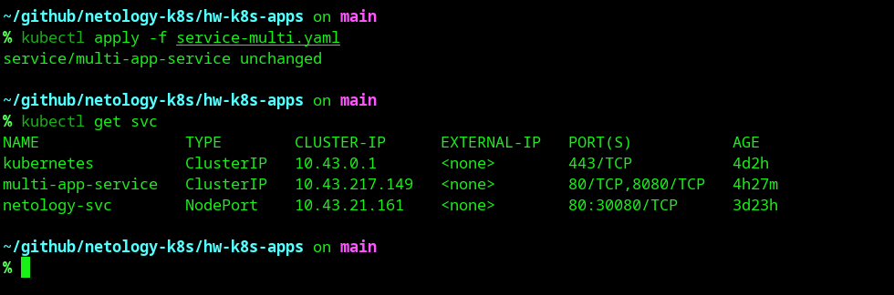
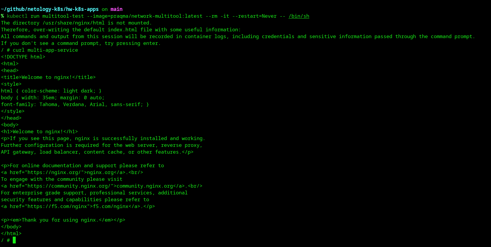
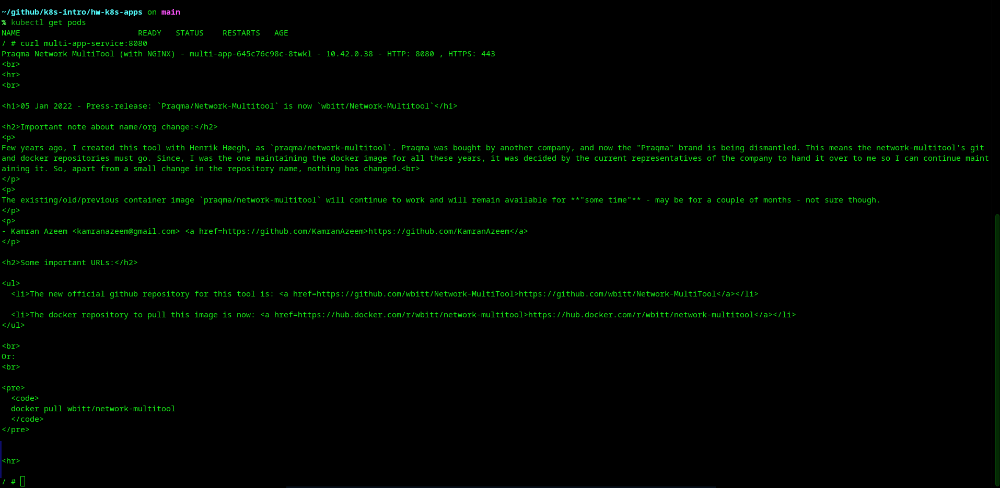
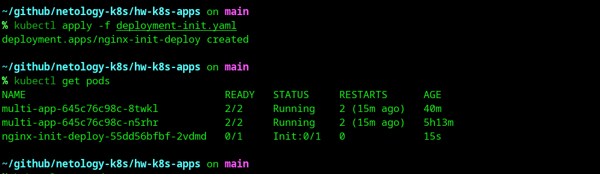
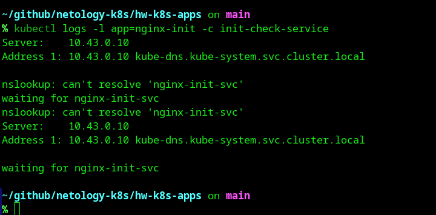
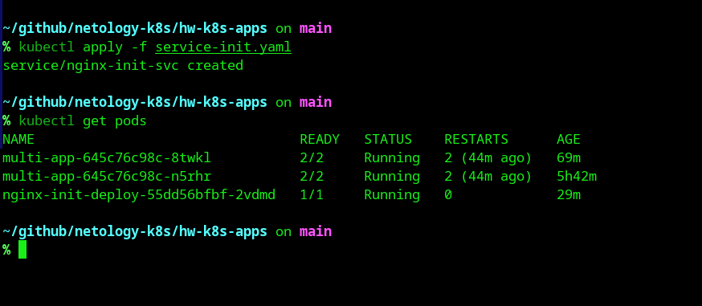

# Домашнее задание к занятию «Запуск приложений в K8S»

## Задание 1. Создать Deployment и обеспечить доступ к репликам приложения из другого Pod

### 1. Создание Deployment с двумя контейнерами (nginx и multitool)
**Проблема:** Оба контейнера по умолчанию пытаются занять порт 80, что вызывает ошибку, так как они находятся в одном сетевом пространстве Pod.
**Решение:** Для контейнера `multitool` изменён порт на 8080 с помощью переменной окружения `HTTP_PORT`.

Манифест: [deployment-multi.yaml](./deployment-multi.yaml)

Результат запуска (1 реплика):
```bash
kubectl apply -f deployment-multi.yaml
kubectl get pods
```



---

### 2. Масштабирование приложения до 2 реплик
Команда для масштабирования:
```bash
kubectl scale deployment multi-app --replicas=2
```

Результат после масштабирования:
```bash
kubectl get pods
```
  

---

### 3. Создание Service для доступа к репликам
Манифест: [service-multi.yaml](./service-multi.yaml)

Применение и проверка:
```bash
kubectl apply -f service-multi.yaml
kubectl get svc
```


---

### 4. Проверка доступа из отдельного Pod
Запуск тестового Pod с multitool:
```bash
kubectl run multitool-test --image=praqma/network-multitool:latest --rm -it --restart=Never -- /bin/sh
```

Проверка доступа к nginx (порт 80):
```bash
curl multi-app-service
```


Проверка доступа к multitool (порт 8080):
```bash
curl multi-app-service:8080
```



## Задание 2. Создать Deployment и обеспечить старт основного контейнера при выполнении условий

### 1. Создание Deployment с Init-контейнером
Init-контейнер проверяет наличие сервиса `nginx-init-svc` и ждёт его появления. Пока сервис не создан, основной контейнер `nginx` не запускается.

Манифест: [deployment-init.yaml](./deployment-init.yaml)

Состояние пода до создания сервиса:
```bash
kubectl apply -f deployment-init.yaml
kubectl get pods
```


---

### 2. Логи Init-контейнера
Init-контейнер циклически пытается разрешить DNS-имя сервиса и выводит сообщение об ожидании:
```bash
kubectl logs -l app=nginx-init -c init-check-service
```


---

### 3. Создание Service и запуск основного контейнера
После создания сервиса `nginx-init-svc` Init-контейнер завершает работу, и запускается основной контейнер `nginx`.

Манифест: [service-init.yaml](./service-init.yaml)

```bash
kubectl apply -f service-init.yaml
kubectl get pods
```
