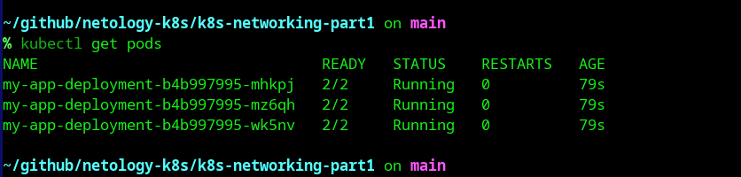
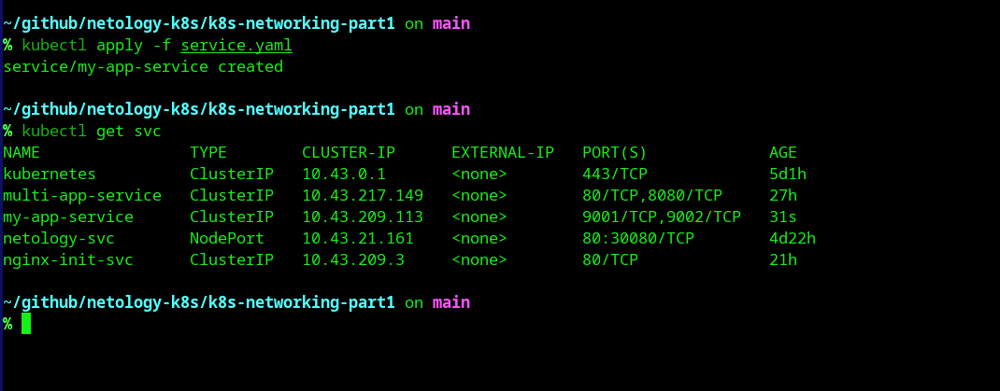
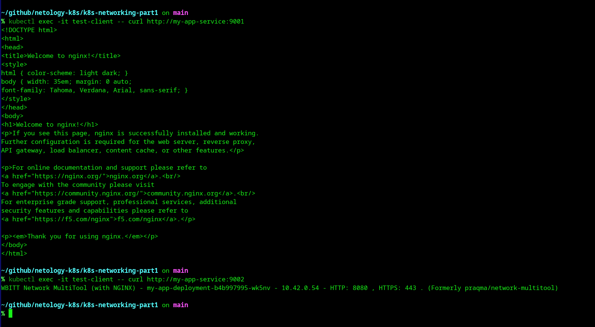
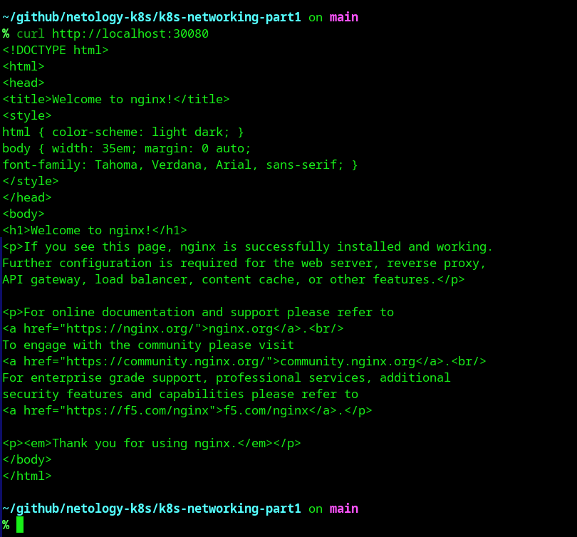
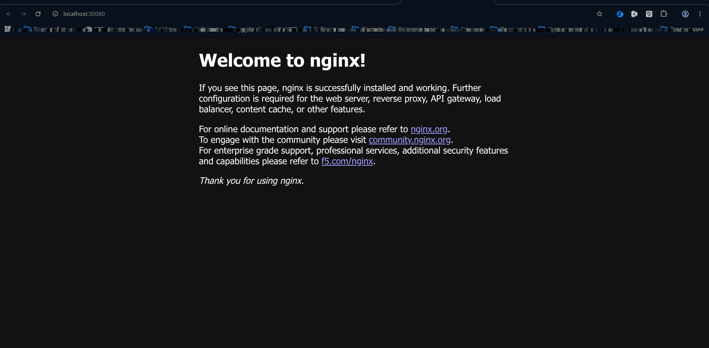

# Домашнее задание: Сетевое взаимодействие в K8S. Часть 1

## Задание 1. Доступ к контейнерам из другого Pod внутри кластера

### 1. Создание Deployment
Создан Deployment с 3 репликами. Каждый Pod содержит два контейнера: `nginx` (порт 80) и `multitool` (порт 8080).

**Манифест `deployment.yaml`:**
```yaml
# ВСТАВЬ СЮДА СОДЕРЖИМОЕ deployment.yaml
```



### 2. Создание Service (ClusterIP)
Создан Service для маршрутизации трафика на разные порты внутри Pod'а.

**Манифест `service.yaml`:**
```yaml
# ВСТАВЬ СЮДА СОДЕРЖИМОЕ service.yaml
```



### 3. Проверка доступа из другого Pod
Создан тестовый Pod `test-client` для проверки доступности приложения по DNS-имени сервиса.



---

## Задание 2. Доступ к приложениям снаружи кластера

### 1. Создание Service (NodePort)
Создан Service типа `NodePort` для открытия доступа к `nginx` снаружи кластера на порту 30080.

**Манифест `service-nodeport.yaml`:**
```yaml
# ВСТАВЬ СЮДА СОДЕРЖИМОЕ service-nodeport.yaml
```

### 2. Проверка доступа снаружи
Доступ проверен с локального компьютера с помощью `curl` и браузера.


