# Домашнее задание: Сетевое взаимодействие в Kubernetes - Шаров Олег

## Задание 1: Настройка Service (ClusterIP и NodePort)

### Развернутые манифесты:
- [deployment-multi-container.yaml](deployment-multi-container.yaml)
- [service-clusterip.yaml](service-clusterip.yaml)
- [service-nodeport.yaml](service-nodeport.yaml)

### Доказательства работы:

**1. Поды в статусе Running:**
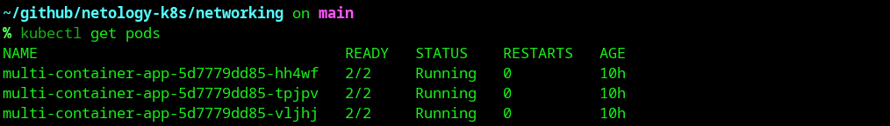

**2. Service ClusterIP создан:**
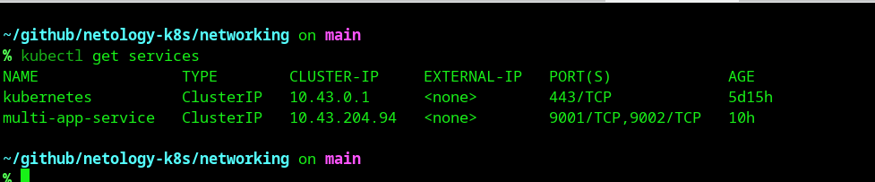

**3. Проверка доступа изнутри кластера (test-pod):**
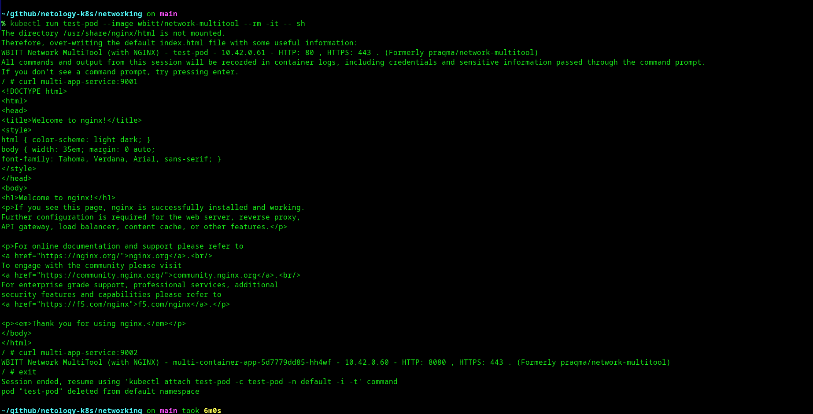

**4. Service NodePort создан:**
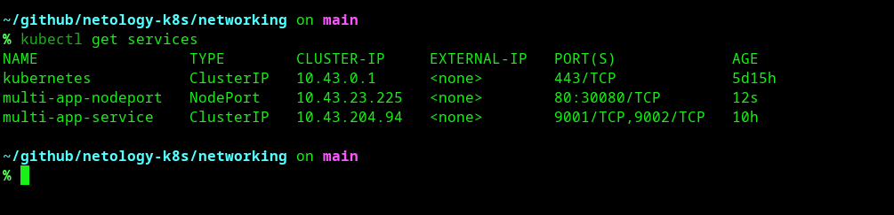

**5. Проверка доступа снаружи кластера (curl с хоста):**
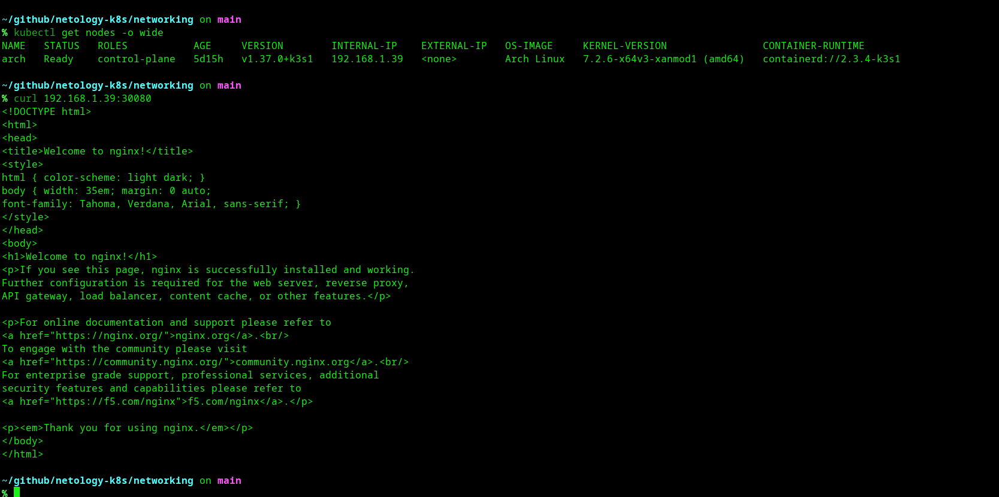

---

## Задание 2: Настройка Ingress

*Примечание: В связи с использованием k3s (Traefik) вместо MicroK8s (NGINX), вместо аннотации `nginx.ingress.kubernetes.io/rewrite-target` был создан Traefik Middleware `strip-api-prefix` для корректного удаления префикса `/api` перед отправкой запроса в backend.*

### Развернутые манифесты:
- [deployment-frontend.yaml](deployment-frontend.yaml)
- [deployment-backend.yaml](deployment-backend.yaml)
- [service-frontend.yaml](service-frontend.yaml)
- [service-backend.yaml](service-backend.yaml)
- [traefik-middleware.yaml](traefik-middleware.yaml)
- [ingress.yaml](ingress.yaml)

### Доказательства работы:

**1. Поды frontend и backend в статусе Running:**
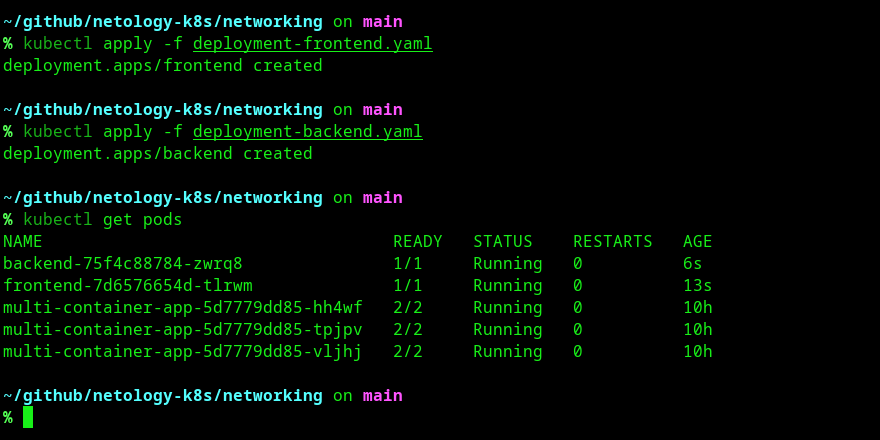

**2. Services для frontend и backend созданы:**
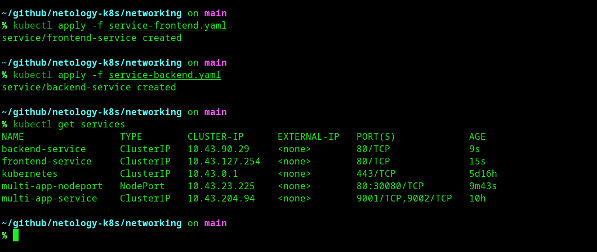

**3. Ingress-контроллер (Traefik) запущен:**
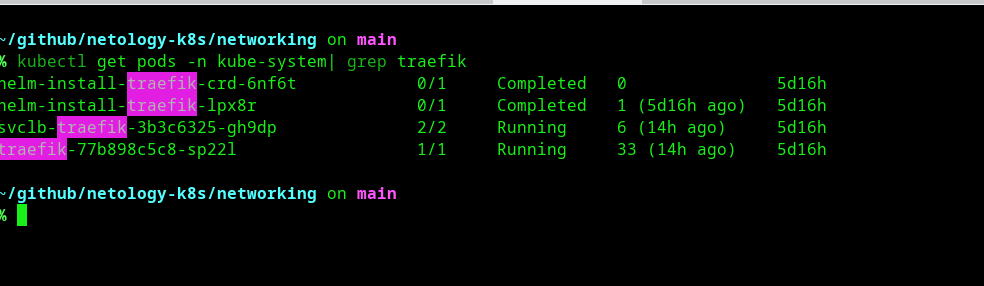

**4. Ingress ресурс создан:**
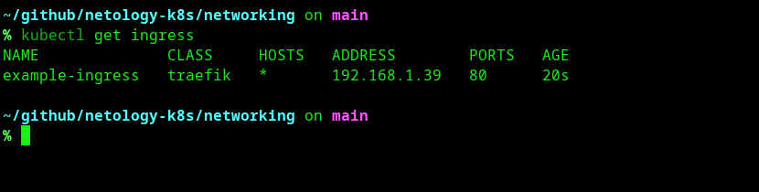

**5. Traefik Middleware создан:**
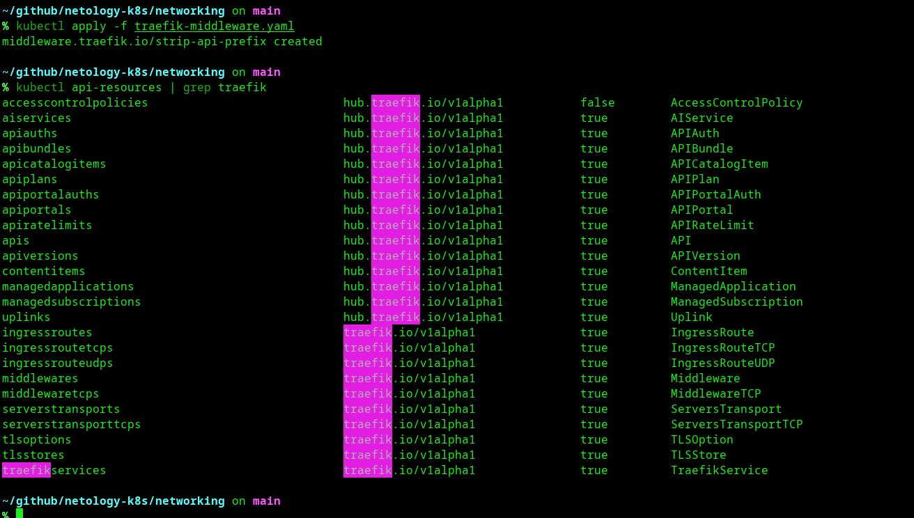

**6. Финальная проверка маршрутизации (curl / и /api):**
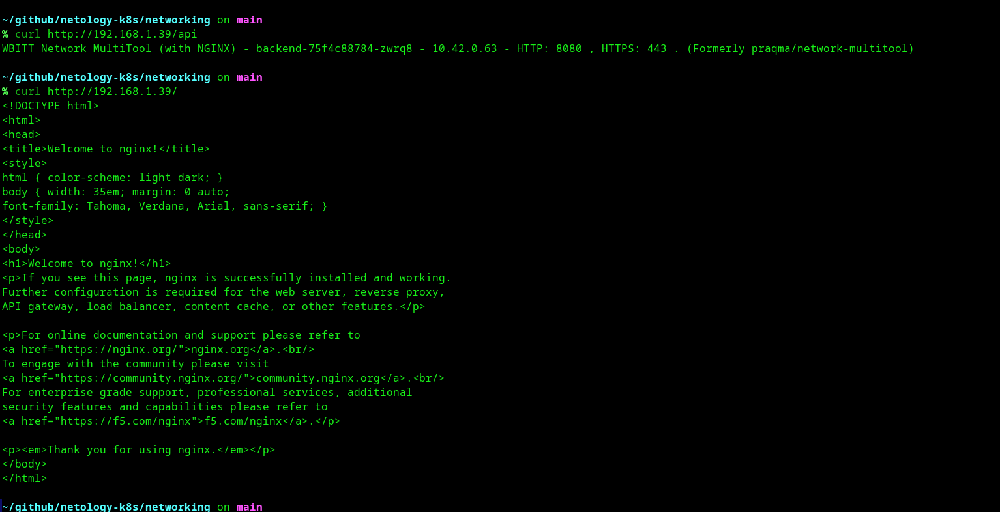