# Домашнее задание: Хранение в K8s - Шаров Олег

## Задание 1. Volume: обмен данными между контейнерами в поде

### Описание
Создан Deployment с двумя контейнерами (busybox и multitool), обменивающимися данными через emptyDir volume.

- **busybox (writer)**: записывает текущую дату в файл `/shared/data.txt` каждые 5 секунд
- **multitool (reader)**: читает файл в реальном времени через `tail -f`

### Манифест
[containers-data-exchange.yaml](containers-data-exchange.yaml)

### Скриншоты

**Рисунок 1:** Статус пода — оба контейнера запущены (2/2 Ready)
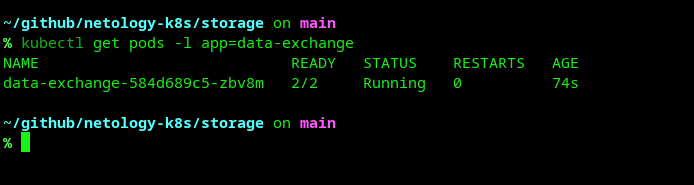

**Рисунок 2:** Демонстрация обмена данными — вывод команды `tail -f`
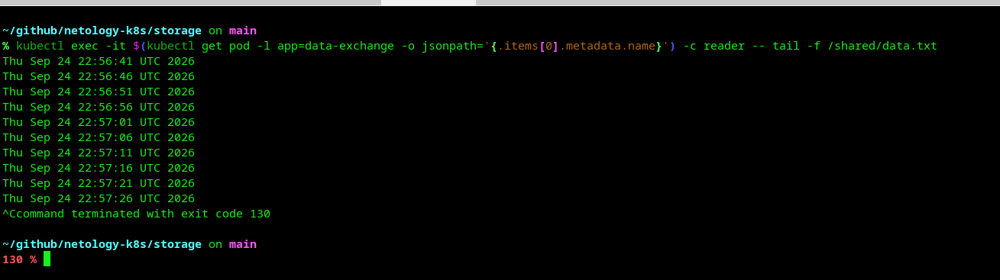

**Рисунок 3:** Описание пода — информация о контейнерах и монтировании volumes
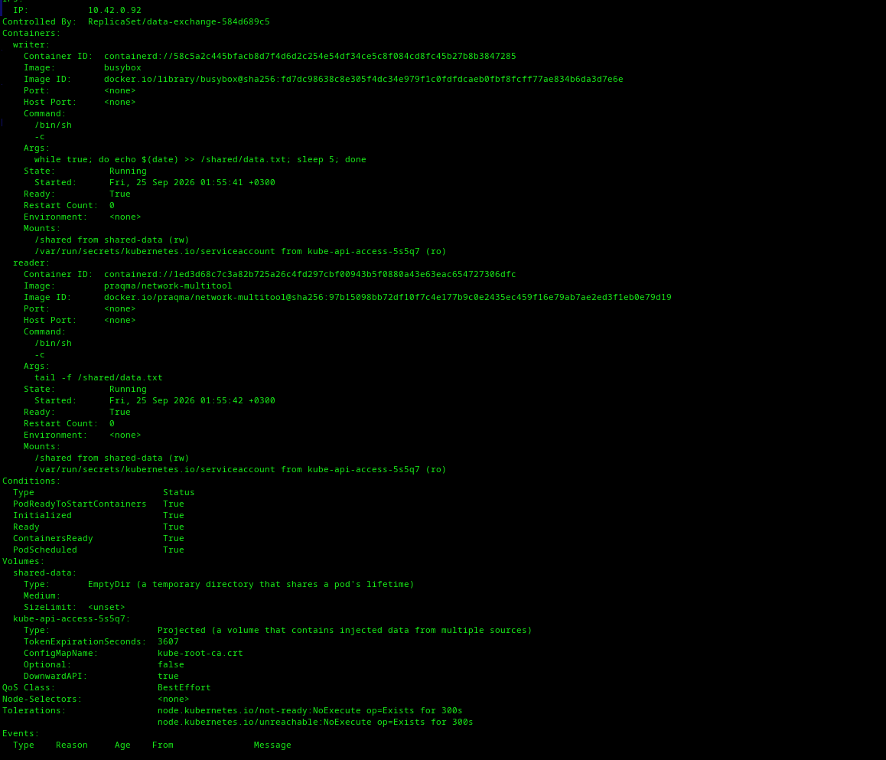

**Рисунок 4:** Описание пода — информация о volumes (EmptyDir) и событиях
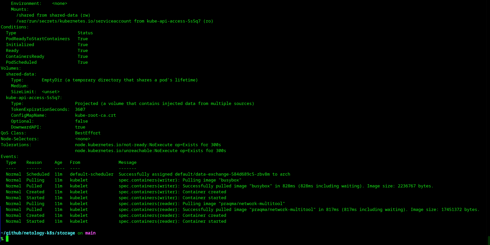

---

## Задание 2. PV, PVC

### Описание
Создан PersistentVolume (PV) с использованием `hostPath` на локальной ноде и PersistentVolumeClaim (PVC) для его использования в поде.

**Ключевые параметры:**
- `persistentVolumeReclaimPolicy: Retain` — данные сохраняются после удаления PVC
- `storageClassName: ""` — ручная привязка PV и PVC без использования StorageClass

### Манифест
[pv-pvc.yaml](pv-pvc.yaml)

### Скриншоты

**Рисунок 5:** Поды запущены и используют PVC

**Рисунок 6:** Удаление Deployment и PVC
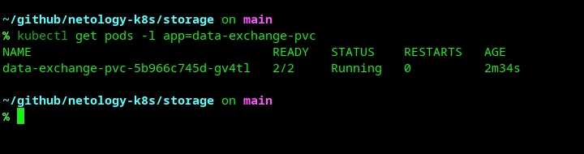

**Рисунок 7:** PV и PVC связаны (статус Bound)
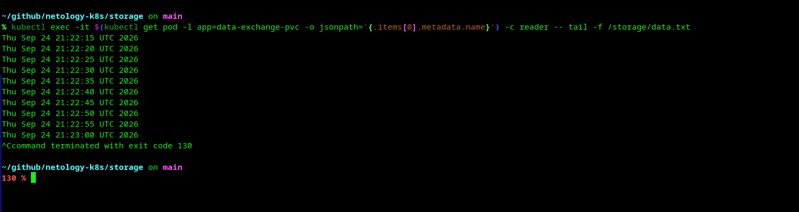

**Рисунок 8:** Чтение данных из хранилища
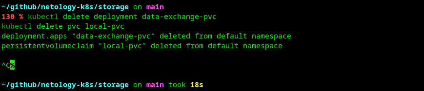

**Рисунок 9:** PV перешел в статус Released после удаления PVC
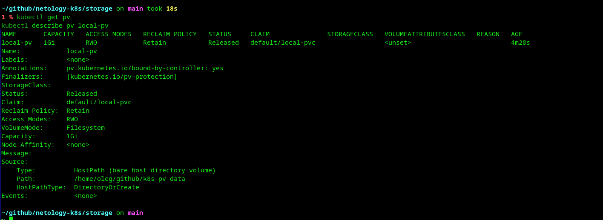

**Рисунок 10:** Файл сохранился на диске ноды после удаления PVC
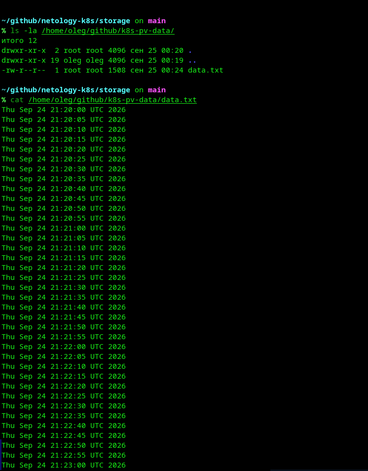

**Рисунок 11:** Файл остался на диске после удаления PV
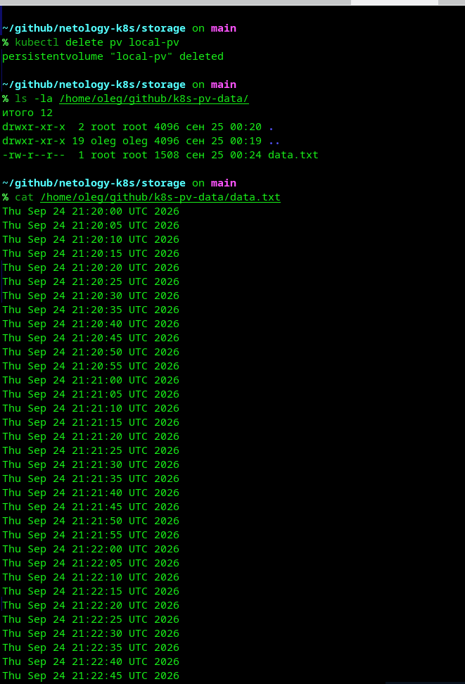

### Пояснения

**Почему PV перешел в статус `Released` после удаления PVC?**

В манифесте PV указано `persistentVolumeReclaimPolicy: Retain`. Эта политика означает, что при удалении PVC сам PV не удаляется автоматически, а переходит в статус `Released`, сохраняя данные на диске. Это необходимо для того, чтобы администратор кластера мог вручную решить, что делать с данными (например, перепривязать PV к другому PVC или удалить его).

**Почему файл `data.txt` остался на диске после удаления PV?**

PV с типом `hostPath` — это не самостоятельное хранилище, а абстракция Kubernetes, которая ссылается на реальную директорию на ноде (`/home/oleg/github/k8s-pv-data/`). Удаление объекта PV из Kubernetes удаляет только метаданные в etcd, но не трогает файлы на хосте. Данные сохраняются до тех пор, пока их не удалит администратор вручную.

---

## Задание 3. StorageClass

### Описание
Создан собственный StorageClass `local-sc` для работы с локальным хранилищем. В отличие от Задания 2, здесь PV и PVC связываются через указание `storageClassName`.

**Параметры StorageClass:**
- `provisioner: kubernetes.io/no-provisioner` — ручное создание PV
- `volumeBindingMode: WaitForFirstConsumer` — PV привязывается только при создании пода

### Манифест
[sc.yaml](sc.yaml)

### Скриншоты

**Рисунок 12:** StorageClass, PV и PVC созданы и связаны
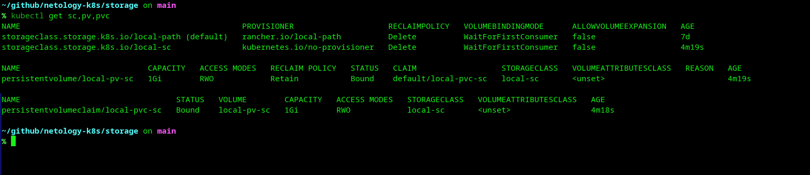

**Рисунок 13:** Поды запущены с использованием StorageClass
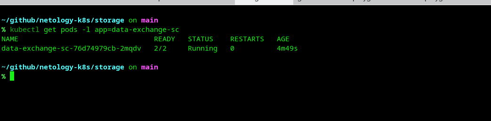

**Рисунок 14:** Чтение данных из хранилища
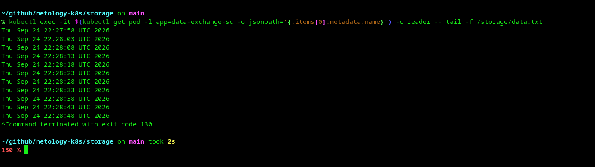

**Рисунок 15:** Файл создан на диске ноды
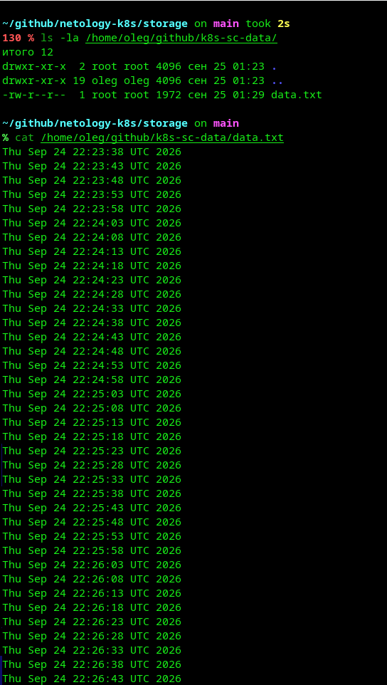

---

## Итоги

В ходе выполнения домашнего задания были освоены:
1. **EmptyDir volumes** — временное хранилище для обмена данными между контейнерами в пределах одного пода
2. **PersistentVolume и PersistentVolumeClaim** — механизм постоянного хранения данных с ручной привязкой
3. **StorageClass** — декларативный способ управления хранилищами через классы

Все три механизма позволяют решать разные задачи: от временного обмена данными до постоянного хранения с различными политиками управления.